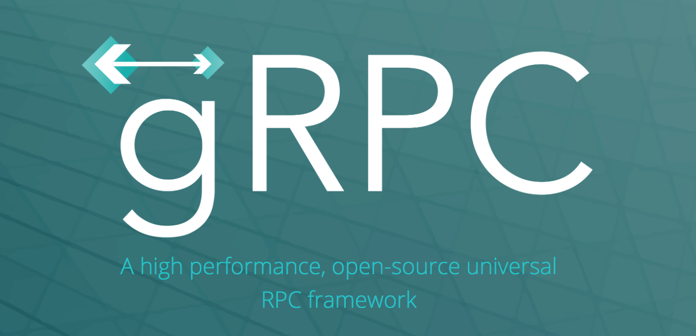
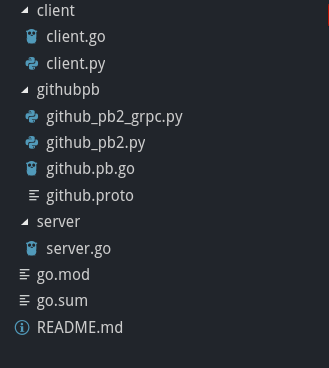
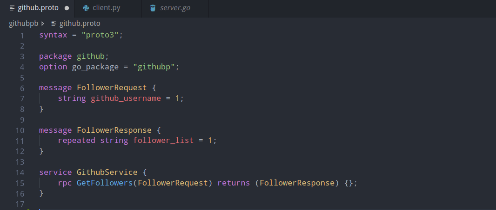
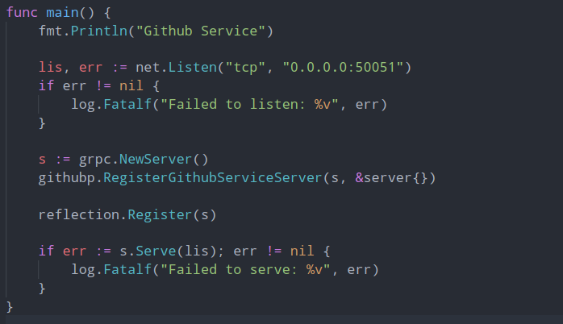
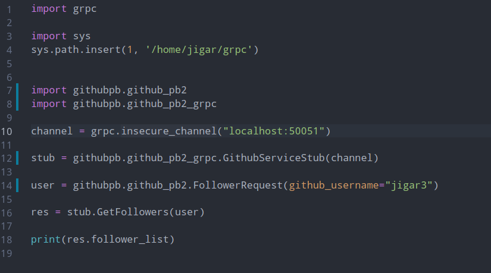
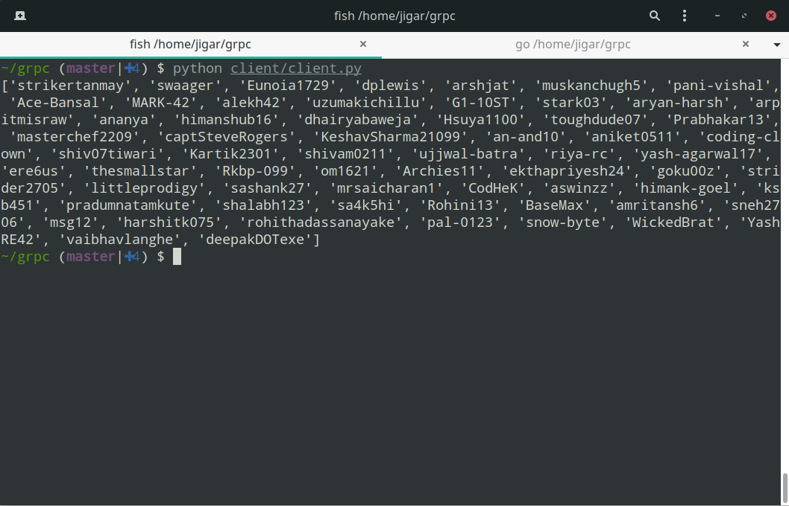
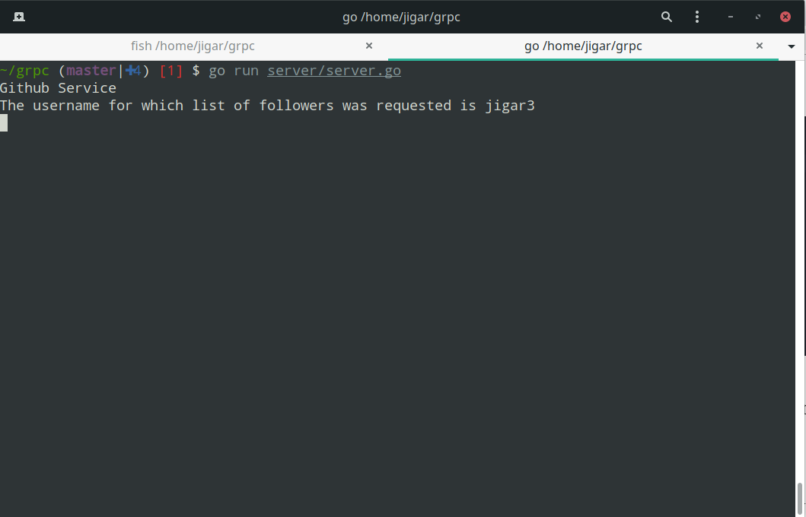

As the title suggests, we will be writing the function definition in Golang and call the function from a Python program. I know this sounds somewhat absurd as to why a person would want to write a function in one language and execute it from another language. But believe me, you do it more often than you could imagine. An example of this would be to when you write your backend API in any of your favourite programming language or framework like Flask, Express, RoR, etc. and calling those APIs within your client which can be anything from a Web App, Mobile App or even a CLI which is many a times written in a different language then your backend. When you call an API endpoint within your client, what you are essentially doing is executing a function in your server whose call is done from your client.

Now having understood when you might need to do this cross language calling of functions, lets discuss more about RPC and its advantages over the REST API approach above.

In RPC, basically what happens is a client application can call methods on a server application which sits on a different machine as if it were a local object to create distributed applications and services. gRPC is a framework developed by Google which enables us to make RPC applications.

> There might be two questions which may arise in your mind at this point of time.
>
> 1. Why do you want to use RPC when you have your trusty REST working just fine ?
> 2. Why would you write a program in one language and execute it from other? (although I have explained it above, this is more to discuss)

Answering the first question, lets say you are building a highly scalable application like Flipkart, now as part of this massively complicated e-commerce site you will need to create atleast a dozen services which will do stuff like inventory management, cart management of user, payments, logistics, recommendations, seller side business logic, etc. As you can see there will be a lot of interdependency among these services like payments service will need to know information from user’s cart, the seller side will need to know about logistics and many other such relations. Say you write a REST API for each of the service and exchange the endpoints with each other. Suddenly, your Slack will be flooded with messages like what parameters should I pass in this API and angry messages about how changing one parameter in your Carts API is making the payments service go haywire. The complicacy increases with increase in number of services and this method is not very scalable. To tackle this people use RPC within their backend, which helps in simplying the talking between these dozens of services. As we will see about Proto files which presents itself as absolute truth about what you send in request and what you get in response when making an RPC call.

Answering the second question, some programming languages are better equipped at one job than others, for example in high frequency trading, speed is of atmost importance so you will have your core logic always written in high performant language like C++, now this service needs to interact with your other services. Therefore, as a business standpoint it makes sense in using different languages for different services.

Enough talking you might think, show us the code. Let’s begin writing the code. We will write a basic program that given a person’s Github Username will return a list of their followers. The entire code can be accessed on my github profile [here](https://github.com/Jigar3/gRPC_101).

The directory structure followed is given below.



Let’s look at the github.proto first



Proto files are the way in which you define what functions are going to be exchanged between server and client. As you can see we have defined a service called as `GithubService` and declared that we will have a function called as `GetFollowers` that will take `FollowerRequest` as parameter and return `FollowerResponse` as response. The keyword repeated here means we intend to have an array of string as the type. In `string github_username = 1`, the number 1 is meant to be an identifier during the serialization and deserialization process. In REST, generally data is passed as JSON but in gRPC it is passed in the form of binary format known as ***protobuf***.

We can’t use this proto file directly to make client and server files, we first need to convert this proto file into actual code. gRPC supports a number of languages, you can check by visiting their [website](https://grpc.io/). You will need the necessary compilers for both Python and Go to compile this proto file into [Python](https://github.com/protocolbuffers/protobuf/tree/master/python) and [Go](https://github.com/golang/protobuf) code respectively. Once installed you can run the below commands to generate files.

```
protoc -I githubpb/ — go_out=plugins=grpc:githubpb/ githubpb/github.proto

python -m grpc_tools.protoc -I. — python_out=githubpb — grpc_python_out=githubpb githubpb/github.proto
```

The files that will be generated automatically will be *github.pb.go, github_pb2.py, github_pb2_grpc.py*

Now, let’s implement the actual code in Golang.

I won’t go over the implementation of the `GetFollowers` function, it is just a normal call to the github API to get the data.



Here, in the main function, we are just registering the Server by using the code which was generated by *protoc* complier. We are serving the server at *localhost:50051*. It’s just standard boilerplate code you need to write to get your server running.

Now, let’s code the client in Python.



The `sys.path.insert(1, ‘/home/jigar/grpc’)` statement is just so we could import files for directory outside the current one.

We are importing the files generated by the python grpc complier. We make a connection to our server on *localhost:50051* and call our `GetFollowers` function on the server. Again, here you will find some boilerplate code to make the actual connection between the client and server.

Now for the results, let’s run both the client and server.





So, we have successfully called a function which was implemented in Go by a python program. You can do the reverse as well implement in python and call in Go. For example, I have made a client in Go as well. You can check out that in the repository linked above.

Hope you got to learn something new and exciting today, feel free to connect and ask doubts.