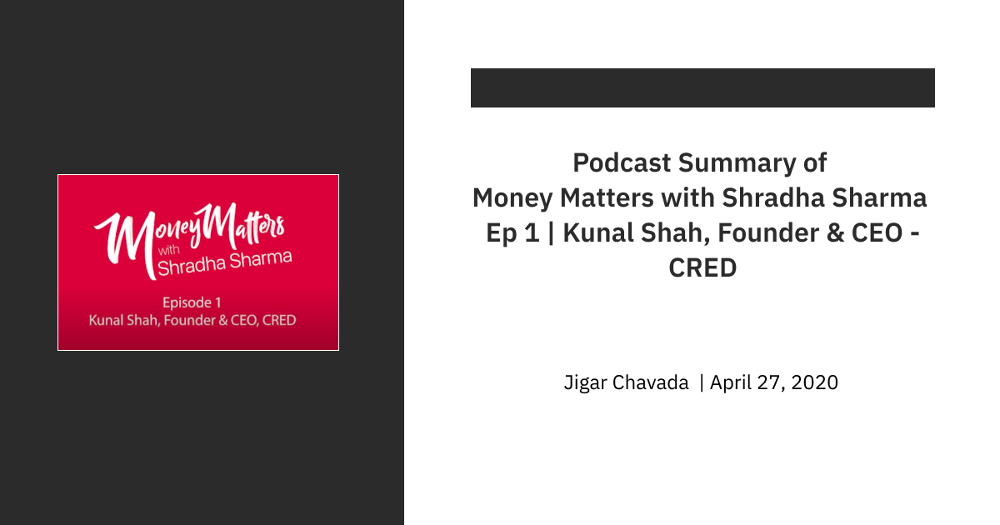

#### **
Link - <ins>https://www.youtube.com/watch?v=12AOcV9lsdU</ins>
**
 

- Most Indians don't come from an affluent background, we have lived majority of our life only on essentials, so it is easy for us to go back to only live on essentials. 
- This pandemic is giving us a realization that most jobs and salary growth happen because of non-essentials.
- It is an opportunity to understand how to thrive in a crisis. Emerge as winners here or be decimated. 
- A crisis is like driving a car in Formula-1, everything is 10x speed, every decision will make you win or cause fatality. You have to be right 10/10 times.
- You will realise in this time, that are you a guy or a company or a founder, that people are willing to back no matter the circumstance i.e are you crisis-proof, if you are not then this is the best time to upskill your self, you have all the time in the world to reflect on the gaps you have. You will see people doing extraordinary things in these crises, see those, learn from them.
- Lots of bad decisions happen when you are out of runway in both your personal life and startup life, so you need to reduce your burn-rate to increase the runway. If your burn-rate is low, no crisis can uproot you.
- People who love to hate wealthy people also hate wealth. Peculiar behaviour in India where people love to hate wealthy people for their wealth.
- You should not envy their wealth but envy their skills.
- Status is a zero-sum game while wealth is not.
- People who are emotional with money, don't understand compound interest.
- Money is a great way to unlock choices in life.
- If a hundred thousand of us learn a skill, we all can make money, this fundamental thing is not understood.
- Culture of coaching classes and notes makes us extremely weak for entrepreneurship. Anything concerned to money and shortcuts hurts both ways. 
- Life has an input metric and an output metric. You can't have output without input. Here the input is upskilling and output is money and status. The only way to gain money and status is by acquiring skills. Insanely obsesses with learning skills
- "How" and "Why" keywords in google trends of India has declined in the last 5 years. There is shame attached to asking questions, how will then we be able to learn if we don't ask questions. Having wild curiosities is important.
- Always try to convert learning into experience.
- The way to extra-ordinary success is through suffering a crisis. So don't ignore one. Learn, Reflect and make notes.
- Reflection as a culture should be adopted.
- No appreciation for deep conversations. (Kya pakka raha hai)
Thus, understanding for life is very shallow, 
- The world is going through compulsory training of becoming more efficient. So when you are away from a person, you don't see his/her charm, just output and outcome matter.
- The largest employer in the world is inefficiency.
- Insecurity comes when we are projecting a different image than ourselves. Insecure people are terrible leaders.
- Wealth happens when your money makes more money than you make. For example, the CEO of a company makes "x" money as their salary but their investment in that company makes "100x".
- Understand the difference between Investment and Expense.