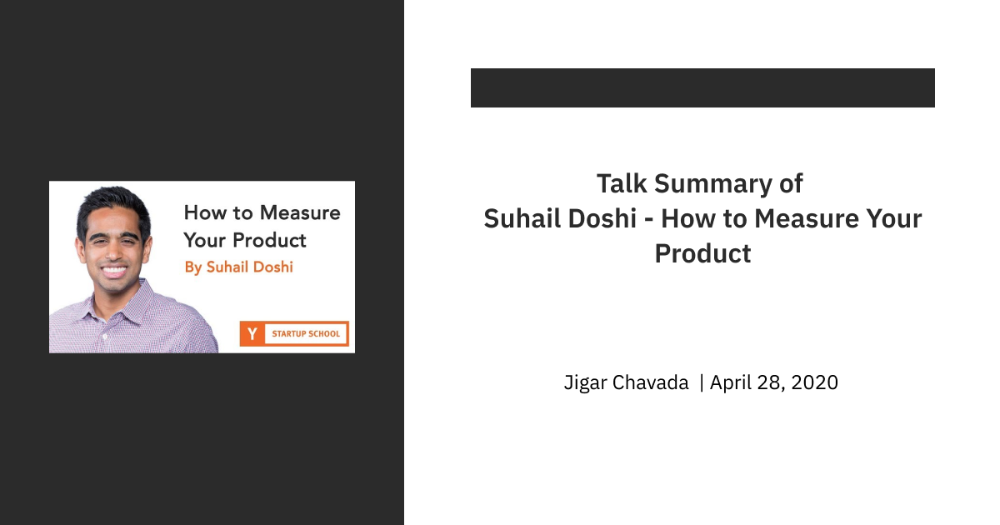

#### **
Link - <ins>https://www.youtube.com/watch?v=MABmQhOlmJA</ins>
**
 

- Things to care about when you start a company
    1. Is my product easy to understand
    2. Is my product easy to get started with
    3. Are people coming back to the product

- First-principles - Let's talk about what things will cause your product to grow. The formula for growth for a successful startup would be:
    - **visits**: people hitting your landing page or mobile app screen
    - **sign-ups**: number of people signing up
    - **people who found value**: the number of people doing the thing the product was made for
    - **retention**: number of people who come back and do that valuable thing again
    - **spread the product**: the number of people who want others to know about your product

- All the above things equal growth.

- Large companies overcomplicate the number of things they should actually measure and track.

- Pick one Northstar metric and monitor 3-5 metrics. Really simplifying n things you measure will do more good things.

- With the above formula, you should be able to asses why you are not growing.

- Once you are able to know why you are not growing, then you should be able to take action on the lever and fix it.

- Is my product easy to understand? Questions to ask - 
    1. Do people bother to sign up
    2. ratio of single-page visits to multi-page engagement
    3. B2B - do they visit your pricing page
    4. B2C - do A/B testing to understand if using your product is easy

- Is it easy to get started with my product? Questions to ask -
    1. people who do one valuable thing (ex- watch a video)
    2. speed of doing that valuable thing
    3. measure the drop through rates of the user trying to find that valuable thing on your website at each step of the funnel.

- Tips & Tricks -
    1. email/text confirmations will have a significant drop-off
    2. constantly iterate on your initial user experience
    3. let users in the product without asking them to signup

- Are people coming back to my product? Ways to measure if people are coming back -
    1. new users who came back 1week or 30 days later to do the valuable thing.
    2. the number of people using the product every day (DAU instead of MAU)
    3. B2B - Revenue churn- monthly revenue lost in a given month

- Poor retention is often the most ignored metric by early founders. It's often the reason even products with millions of user die.

- Q - What if I have less than 50 users/customers?  
A - Talk to users, write everything down

- You will get way more information by talking to customers then you will get by looking at a data point in a graph.

