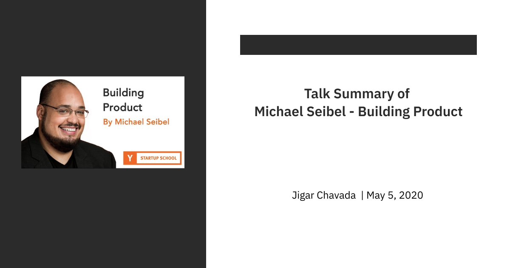

#### **
Link - <ins>https://www.youtube.com/watch?v=C27RVio2rOs</ins>
**
 

- He is the co-founder of two very successful startups - Justin.tv/Twitch and Socialcam. He broke almost all the rules that are mentioned below at various points towards building those startups. The things that allowed them to survive was 
    1. The founding team was extremely technical (the most amazing thing that resulted from the team being extremely technical was they were not intimidated by any technical challenge).
    2. Didn't spend a lot of money, moved out when they were in the early twenties, lived in a 2-bedroom apartment, which cost $ 2500 a month. Also, they used to get only $ 500 a month walking around money which is technically below the minimum wage. 

- These two things gave them a lot of ability to screw up in the beginnings of their startup. 

- Also, the founders' ego was highly tied to the startup, they were not doing a startup to have a cool thing on their resume, it was the only thing they had done on their own, so at various points, during the company, it looked like the startup failing was their life failing. They all had this fear of falling which made them never to think of giving up.

- So the first question to ask while building product is - What problem are you solving?

- Most of the times when founders pitch their startup, they want to tell what their idea is and what their product is. The interesting thing is that often times they don't know why, they don't know what problem they are expected to solve at the end of whatever they are doing.

- At Justin.tv the problem they were solving was entertainment. Justin was the first one who broadcasted his life 24*7 but no one was watching, so they knew the idea isn't working because the problem is not getting solved, so they pivoted to an open platform where the problem became 'Can we let anyone broadcast live?". Once again knowing the problem they are trying to solve it became easier for them to evaluate if the product is succeeding or not. 

- The list of questions to ask yourself while building your product are:
    - **Q. Can you state the problem clearly?**  
    -> If you can't then you don't know the problem. If someone asks you this question and you find yourself delivering an essay, you are doing it wrong. You should be able to explain it in two sentences max.

    - **Q. Can you define this problem narrowly?**  
    -> So when you start, it isn't possible for you to solve the problem for everyone. You need to double down on the people for which you can solve the problem now, at the current instant. Defining your problem narrowly helps you to visualise about who your first customers should be and also will tell you a lot about if the problem you are trying to solve is actually solvable or not.

    - **Q. Who is your customer?**  
    -> You don't really understand a problem until you know who exactly it is you are solving for. And no, everyone isn't your customer. In almost all of the products that everyone uses now, there used to be a time when no one used it. The creators of that product had to figure out who is the ideal first customer. If you don't have a good answer to this question, you are going to get lost, you wont have any idea about whom to talk to, to ask them if this problem has been solved or not. It is surprising to see a number of founders who are building something, like if they are writing a creative novel, where its just a product of their own brain and no interaction with anyone outside. 

    - **Q. How often does your user have the problem and how intense is the problem?**  
    -> It helps if you are trying to solve a problem that arises frequently. You should always do this frequency and intensity analysis on your idea. So if you have both infrequent and low-intensity problem you are trying to solve, you are going to have a problem getting a lot of customers even interested in talking to. All things equal, if you grapple a problem its desirable for it to be high frequency & high intensity. Let's take Uber as an example. Usually when you are somewhere and you need to go someplace else, its a pretty intense problem. It's so intense that the user might buy a $20,000 car of it. Also, when you think about frequency, how often to you move more than walking distance,  a lot I guess. High-Intensity problem with high frequency means that is a really good business to be in.

    - **Q. Are they willing to pay?**  
    -> If you want to know whether you have a good product, its a lot easier to make it a lot harder for users to use it, by say charging a premium. And if they still continue using it, you know you have got a good product. So, starting with a higher price or a price, in general, is better than starting free.

    - **Q. How easy it is for your customers to find you?**  
    -> This question is really important because inevitably they need to reach to you. If your customers are ridiculously hard to find, it is important that you address this issue pretty early on. You can't build the whole thing and exact them to find you.

    - **Q. Does your MVP actually solve the problem?**  
    -> In the process of building an MVP, things go haywire pretty often, you have this problem, you start building it, you talk to users, and before long you are launching something, and you realise that it doesn't do the thing you promised or set out to build in the first place.

    The way to know this is only by giving your product to users. A lot of people think their product as a painting, as something that could be appreciated as a piece of art, as something even if it's appreciated by one person, its special. But products are not art, the startup world is very unforgiving to artists. The definition of art is it has to be appreciated by only one person or maybe even none, only the creator itself. But products are different you want a larger set of people to appreciate it and use it.

    - **Q. Which customers should you go after first?**  
    -> The short answer is the easy ones. The instinct is often to go after the hardest customers first. The founders think of it as a proof, like if I get this impossible person to use my product then I know it as proof that whatever it is I have created is valuable. But the point is of MVP is you know you have made something bad, it is the minimum viable product that solves the problem. People willing to use a bad product are the ones who are most desperate, the easiest ones, target them first.

