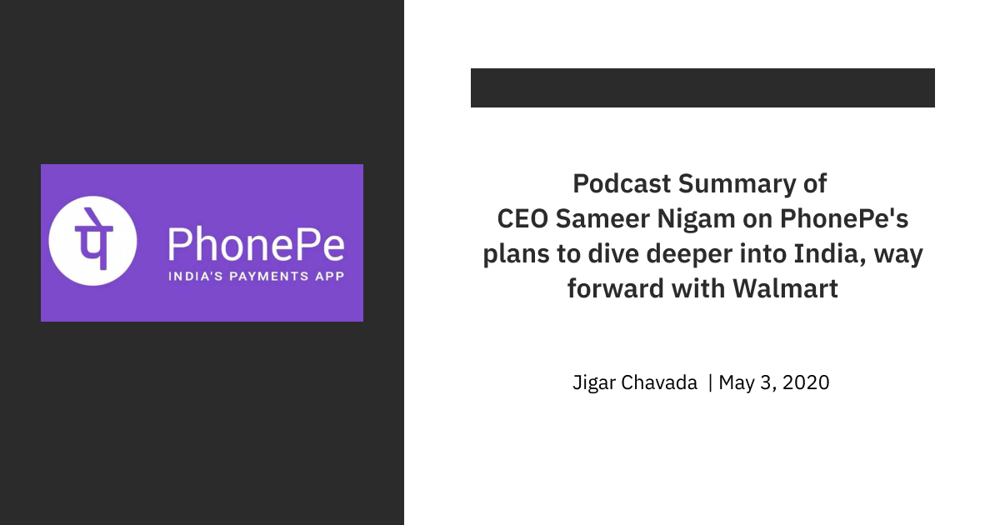

#### **
Link - <ins>https://www.youtube.com/watch?v=nrLiOOm4_sw</ins>
**
 

- The founders of Phonepe had previously been at Flipkart and they saw this explosive growth in e-commerce. Having got tired from it, they took a break and then looked at areas where they can have a broader-based impact on the economy.

- Payments & Financial Services looked like an industry where there were big gaps in what the market is capable of, what the technology is capable of at that point and what was in play at that time.

- At that time, UPI was just an idea on the board that NPCI was talking about, they talked to a bunch of banks and asked that if they could do payments and everyone obviously said no, but then UPI came out in the picture. The founding team looked at the white paper architecture of it and decided if this goes live in India, there's a chance that 500 million Indians in 5 years will start doing digital payments.

- Every Indian had a bank account thanks to Jan Dhan Yojna, the prices of smartphones were cheaper than ever, the price of data went down massively due to 4G and Jio.

- When thinking about how do you use technology and data, to transform the economy, there's nothing bigger than financial services. Easy loans, insurance, digital payments, the data footprint you get using payments can be used to improve the lives of both the merchants as well as the consumers.

- The formal economy in the past 25 years never really catered to the needs of small-shop owners and always focused on the organised sector.

- Phonepe actually is trying to cater to the needs of these small shops or Kirana stores. 

- It is a highly competitive market, but a lot of effort has been put in on customer service as well as automated risk and fraud prevention, based on those two things if you compare Phonepe with any other apps, their stickiness levels are very much higher than any other player. 

- What a small shop owner wants is majorly footfall. But they don't have any CRM tools and also don't have local marketing capabilities. The best they can do is put a pamphlet in the local newspaper.

- PhonePe has the stores tab on their app, which helps the merchant drive lakhs of customers into their shops if they choose to market right.

- When we go in big shops, we see they have this huge inventory based offers, discounts during Diwali and Holi and other such festivals but the equivalent doesn't happen in these small shops, now you can create that environment using PhonePe.

- Consumers and merchants both need working capital or loans. India is starved for credit on both sides. We always talk about this - 25 million credits cards, loan outstanding to roughly about 1 million merchants formally. But obviously everyone is getting money, so it is in the unorganised sector, where the interest rates are insanely high. This is because you don't have credit bureaus that cater to every Indian.

- Jan Dhan Yojna made sure that every Indian has a bank account. DBT transfers are happening there, they are using Aadhar, they are using whatever medium they can. So, the government is doing their part, they have created the infrastructure. What Phonepe as an industry players can do is create really good experiences and open a really big ecosystem of partnerships.

- They can't possibly serve to every Kirana store on all the possible use cases. So they got to find all the right partners who will provide these use cases to this small shop merchants.

- Phonepe can't lend to every Indian, not even to every Indian business. So they got to tie up with the banks, tie-up with the NBFCs, tie with insurance companies. That is the plan, open up a platform and an ecosystem around it that really enables commerce at scale.

- What sets them apart is they understand the grass-roots much much better, they have 8-10 thousand people on the ground. This is something that separated Flipkart back in the day and still does. This is what separates folks like Udaan now. The ability to put thousands of people on the ground, deal with millions of Kirana shops, deal with their motivation, their aspirations. You cant do it just with API and code. You have to in India, invest in people on the ground, train the people on the ground. 

- 70-75% transactions and customers both are from tier-2 & tier-3 cities. This is a testament to the fact that digital payments is penetrating, very very rapidly in India.

- UPI has captured peoples imagination on money transfer. Now no longer do people, like migrant workers they don't have to actually go into a physical shop, pay 2% for money to be transferred to their family. They call it "Queue Busting", the queues are now gone because 150 million people are now on UPI.

- India is very data-rich, but India is far behind the west or even China in harnessing the power of that data. Every large company or startup talks about how data is the new oil, but we have not built over refineries yet.

- How they are leveraging ML?
    1. **Customer service** - 80% of interactions start with a chatbot, so they made an ML-based response system on top of the bot, that on the basis of the time of the transaction, patterns at which the customer came in and filed the complaint, it gives the likelihood of what the issue might be and then you start engaging so that the customer doesn't need to manually type in every little detail, you can guide them along the way and you can provide information such as based on the 99th percentile,  this is how quickly this issue will get resolved, etc. and today because of this, 80% of their tickets get closed automatically, with a high customer NPS.

    2. **Risk & Fraud** - Today they process 14-15 million transactions a day, but they also reject close to 0.75 million transactions a day as well. They don't allow these transactions to go through, they have to intervene because they know there's likely fraud happening. For example, if you are constantly transacting in Bangalore, and suddenly they see a pattern of transactions happening in Delhi, Jharkhand and Bengal, they know that something might be wrong, so they will prompt the user to enter the password again for the app. They do various such things with the vast amount of data points they gather each transaction.

- Q - How do they make money or think of monetisation?  
  A - It breaks down into 3 broad buckets:
    1. Payments related money (MDR)
    2. Advertising (Switch Platform)
    3. Financial Services (Gold, Mutual Funds, Insurance, etc.)

- Q - How Phonepe views banks?  
A - What Phonepe doesn't know is how to operate a bank from an operational standpoint, what they know is how to delight customers from an experience standpoint, that includes applications and experiences on financial services. Phonepe's pitch to the banks has always been think of us as your most intelligent distributor, they have the distribution and are trying to add the intelligence around who really needs what kind of products, as that's the conversation the BFSI industry has not done well in. They have typically catered to those who have the money and the disposable income and offered products at a very high margin, but mass-market India is paying even higher interest on loans. Microfinance has also shown this, people pay 70-80% interest rates which is just outright exploitative. The banks should also be able to offer somewhere between 18% to corporates and 80% to microfinance at scale. Phonepe will get the customers to them, they will get the merchants to them, but they want the banks to build the products out for them. 

- Fintech is very hot among investors, as per reports, there is lots of interest in this market. The reason for this is because it is so underserved. Insurance at 3% and mutual funds has barely scratched the surface.
 