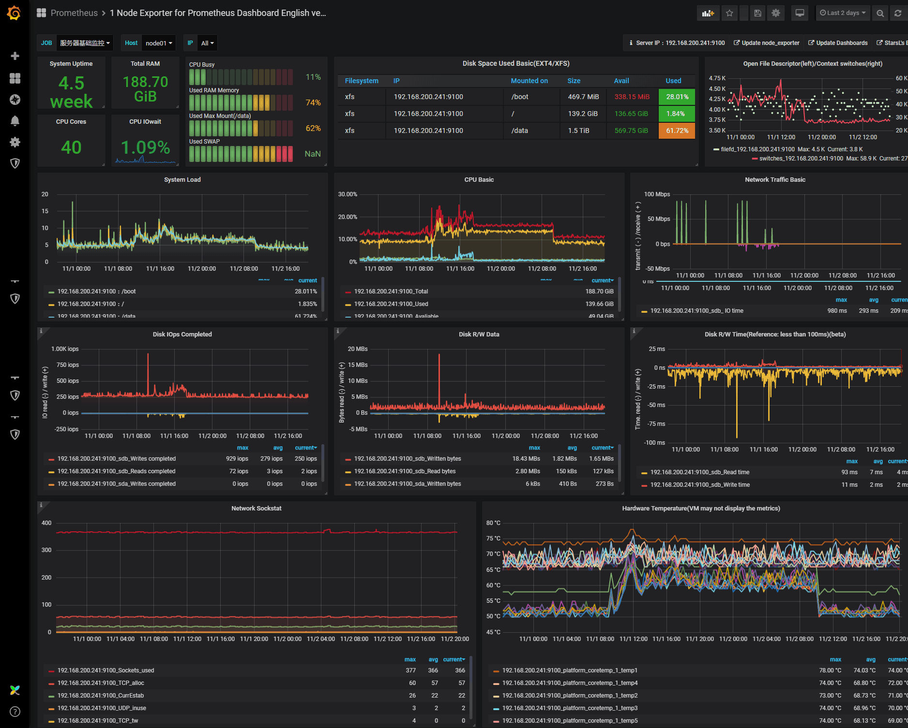
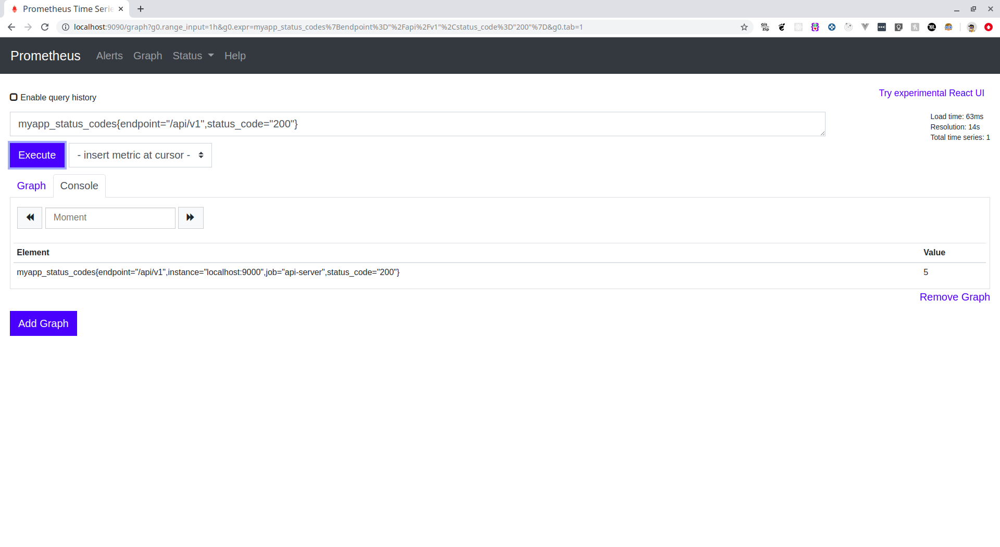
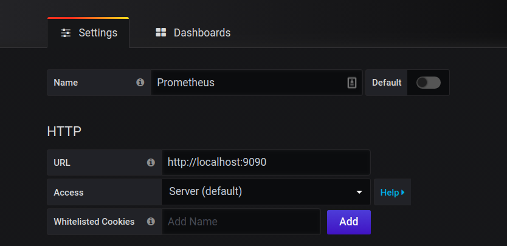
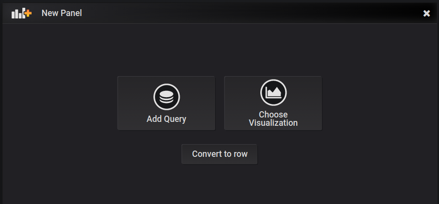
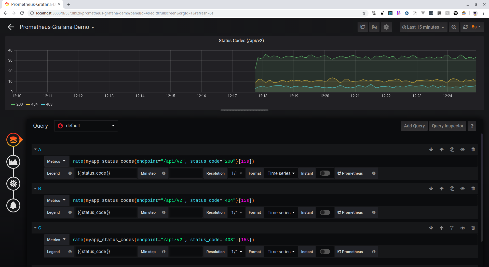
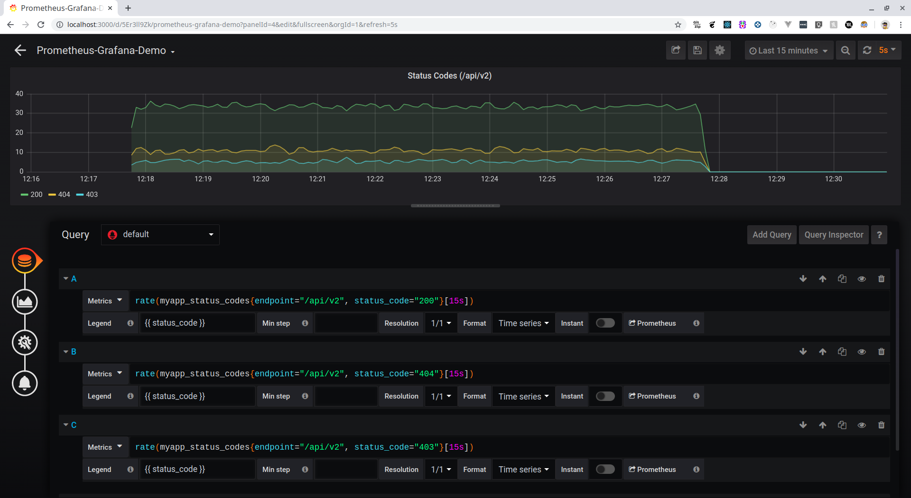
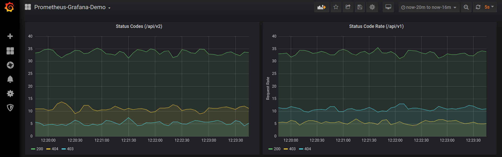

Prometheus is a tool which is used for Systems and Service Monitoring. The piece of code programmers write is to be run on actual hardware which means we are utilizing a physical resource that costs us money to operate on. So we better utilize this resource in the most efficient manner. This is where systems monitoring comes in picture. Running complex applications on actual servers is complicated and things can go haywire because of several reasons. Some potential problems which can occur are:

- Disk Full -> No new data can be stored
- Software Bug -> Request Errors
- High Temperature -> Hardware Failure
- Network Outage -> Services cannot communicate
- Low Memory Utilization -> money wasted

These problems occur more often than you think, so it necessary to monitor your systems and services to keep check of their health.

Monitoring means to get information from your system, to get insights and act on those insights. There are different ways in which you could do the monitoring.

- Check Based Monitoring -> Run scripts periodically to check the health of servers. Very Static. Very Local Context based on individual machines.
- Logs/ Events -> Record full details about each event. Can be structured and unstructured. Further analysis required. (Loki, InfluxDB). Lack of interservice correlation.
- Metrics/ Time Series -> Numeric values, sampled over time. (OpenTSDB, Prometheus), good for aggregate health monitoring. Need logs for detailed analysis though.

For inter-service correlation, we use Tracing, track single requests through the entire stack. (Jaeger).

Prometheus is metrics-based monitoring & alerting stack made for dynamic cloud environments. It doesn’t do logging or tracing.

### Architecture of Prometheus:

There are things called as targets from which Prometheus server pulls time-series metrics at regular intervals and store it in a local disk.

These targets can be of two types, one in which you have control over the source code like your web app or your API which is what we will be doing, here you can use a Prometheus client library to execute an endpoint from which Prometheus can gather this data.
Another target is something which you don’t necessarily have control upon like a Linux VM or a SQL DB instance. In this case, you use something called an exporter which sits on top of this system and sends metrics to Prometheus.

Prometheus server is then configured to pull or scrape data from these targets and stores these time series metrics on a local disk.


Having given you enough explanation about what and how of Prometheus, let us create our service and monitor it using Prometheus. You can check out the Github Repository which contains all the code [here](https://github.com/Jigar3/Prometheus-Grafana).

Let’s start by creating our server.

```:title=main.go
package main

import (
	"log"
	"math/rand"
	"net/http"
	"strconv"
	"time"

	"github.com/prometheus/client_golang/prometheus"
	"github.com/prometheus/client_golang/prometheus/promauto"
	"github.com/prometheus/client_golang/prometheus/promhttp"
)

var (
	listOfCodes = []int{http.StatusOK, http.StatusNotFound, http.StatusForbidden}
)

func init() {
	rand.Seed(time.Now().UnixNano())
}

func main() {
	http.Handle("/metrics", promhttp.Handler())
	http.HandleFunc("/api/v1", getRoute)
	http.HandleFunc("/api/v2", getRoute)
	err := http.ListenAndServe(":9000", nil)
	if err != nil {
		log.Fatal(err)
	}
}

func getRoute(w http.ResponseWriter, r *http.Request) {
	rnd_no := 1 + rand.Intn(9)
	statusCode := listOfCodes[0]
	if rnd_no == 7 {
		statusCode = listOfCodes[2]
	}
	if rnd_no == 3 || rnd_no == 5 {
		statusCode = listOfCodes[1]
	}

	statusCodeProcess.With(prometheus.Labels{"endpoint": r.URL.Path, "status_code": strconv.Itoa(statusCode)}).Inc()

	if statusCode == http.StatusOK {
		w.WriteHeader(statusCode)
		w.Write([]byte("200 - Status OK!"))
	}
	if statusCode == http.StatusNotFound {
		w.WriteHeader(statusCode)
		w.Write([]byte("404 - Status Not Found!"))
	}
	if statusCode == http.StatusForbidden {
		w.WriteHeader(statusCode)
		w.Write([]byte("403 - Status Forbidden!"))
	}

}

var (
	statusCodeProcess = promauto.NewCounterVec(prometheus.CounterOpts{
		Name: "myapp_status_codes",
		Help: "Gives status codes of particular route",
	},
		[]string{"endpoint", "status_code"},
	)
)
```

So what we are essentially doing in this piece of code is creating two endpoints, which are `/api/v1` and `/api/v2`. Whenever you hit these endpoints, you get either a `200` or `404` or `403`. The function is coded in such a way that the probability of getting a `200` is more than `404` which in turn is more than `403`.

The metrics which we will be monitoring are displayed on the `/metrics` endpoint, which we have already populated with some metrics by using the `promhttp.Handler()`. Some of these pre-populated metrics include *go_goroutines: Number of goroutines that currently exist, go_memstats_alloc_bytes: Number of bytes allocated and still in use, go_threads: Number of OS threads created and many more.*

There are four metric types which you could use, I am using the `Counter` type metric. You can check other metrics [here](https://prometheus.io/docs/concepts/metric_types/). Every time series is uniquely identified by its *metric name* and optional key-value pairs called *labels*. Here, we have used the *metric name* `myapp_status_codes` and are using two labels `endpoint` and `status_code`. The `endpoint` will give us the name of the endpoint which is being hit while the `status_code` will return status code.

```noLineNumbers
statusCodeProcess.With(prometheus.Labels{“endpoint”: r.URL.Path, “status_code”: strconv.Itoa(statusCode)}).Inc()
```

The above line of code Increments the counter and sets the labels with appropriate values.

Now, we can run the server by executing `go run main.go`. You can visit [http://localhost:9000/api/v1](http://localhost:9000/api/v1) or [http://localhost:9000/api/v2](http://localhost:9000/api/v2) and check the responses. The counter value can be searched in [http://localhost:9000/metrics](http://localhost:9000/metrics). You will see something like

```noLineNumbers
# TYPE myapp_status_codes counter
myapp_status_codes{endpoint="/api/v1",status_code="200"} 1
```

Here `1` indicates the number of times endpoint `/api/v1` was hit and returned a `200` response.

Now as our target is ready, we need to create a Prometheus server that will scrape our API server. To create a Prometheus server, we need to create a config file.

```:title=prometheus.yml
scrape_configs:
  - job_name: 'prometheus'
    static_configs:
    - targets: ['localhost:9090']

  - job_name: 'api-server'
    scrape_interval: 5s
    static_configs:
    - targets: ['localhost:9000']
```

The format for writing this config file can be found [here](https://prometheus.io/docs/prometheus/latest/configuration/configuration/). We can now run the server by executing

```noLineNumbers
prometheus --config.file=./prometheus.yml
```

Now, you can go to [http://localhost:9090](http://localhost:9090). You will be greeted will the below-shown screen



You can now enter a PromQL expression and query the metrics. You can find a guide about how to query using PromQL [here](https://prometheus.io/docs/prometheus/latest/querying/basics/). You can do a lot of useful stuff here alone, but we will go ahead and connect Prometheus with Grafana and make beautiful graphs that will give us useful insights about our service as well.

**Grafana** is open-source visualization and analytics software. It allows you to query, visualize, alert on, and explore your metrics no matter where they are stored. In plain English, it provides you with tools to turn your time-series database (TSDB) data into beautiful graphs and visualizations.

You can install Grafana by following instructions mentioned [here](https://grafana.com/docs/grafana/latest/installation/). Once installed you can run a Grafana server by executing

```noLineNumbers
grafana-server
```

This will start a Grafana server on [http://localhost:3000](http://localhost:3000). The default username and password both are admin. Before you start creating beautiful graphs, you first need to Import Prometheus as a data source. You can find to option to Add Datasource on the home screen itself. Select **Prometheus** as a data source and it will direct you to a Settings page, where you need to fill in the appropriate details as shown below.



Now, click on **Save & Test**. You should be seeing a notification that says *Data source is working*.

After adding **Prometheus** as a data source, we will make a new dashboard, to do that, press the `+` icon in the left pane and click on the dashboard. You will be greeted by the below screen.



Click *Add Query*, you will be taken to the New Dashboard Screen, where we can make those beautiful graphs using PromQL queries as discussed above.

The query which we will be performing is the rate at which we get requested on a particular endpoint and what response is being returned. The `[15s]` means that we are getting rate as measured over the last 15 seconds.

```noLineNumbers
rate(myapp_status_codes{endpoint="/api/v1", status_code="200"}[15s])
```



Similar to the above rate query for `200` response, we have done the same for `403` and `404` as well.

You can do the same now for the other endpoint, below shown is a sample for the other endpoint.



To generate traffic on our custom server, I am using a tool called [Vegeta](https://github.com/tsenart/vegeta). It is a tool used to simulate traffic on a given endpoint. You can install the tool from its Github Repository. To use *Vegeta* to simulate traffic, write the command.

```noLineNumbers
~ $ echo "GET http://localhost:9000/api/v1" | vegeta attack -duration=600s | tee results.bin | vegeta report
~ $ echo "GET http://localhost:9000/api/v2" | vegeta attack -duration=600s | tee results.bin | vegeta report
```

These commands will hit the particular endpoint on the server for 600s and you can watch the same on the Grafana Dashboard you just created.

You may think what is the need for checking what status codes which are being returned on a particular endpoint, so let’s take an example of a Payments Gateway service, it will be important to keep a track of successful and unsuccessful responses which are being returned when a user is paying using the service, a sudden spike in unsuccessful responses should mean that something is wrong with the server and you should immediately rectify whatever the problem.

The final dashboard will look something like below.



Hope you were able to understand and follow along on making a Monitoring Dashboard with Prometheus + Grafana. Thanks for reading. If you have any questions, feel free to leave a response.


#### Resources for further reading:

- https://www.youtube.com/watch?v=5O1djJ13gRU (An amazing video to understand why the need for Prometheus)
- https://www.scaleway.com/en/docs/vegeta-load-testing/
- https://tomgregory.com/the-four-types-of-prometheus-metrics/
- https://medium.com/@valyala/promql-tutorial-for-beginners-9ab455142085