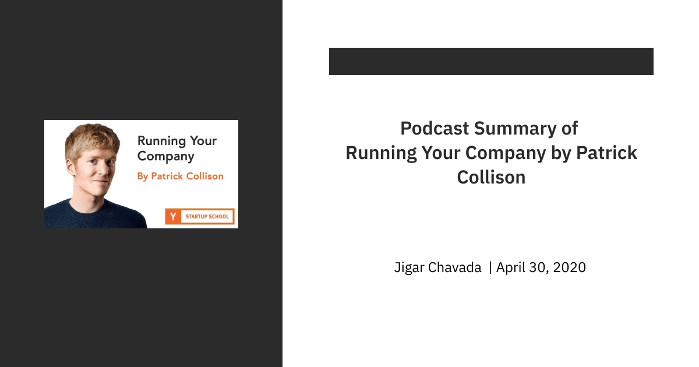

#### **
Link - <ins>https://www.youtube.com/watch?v=NprBQi0cSHU</ins>
**
 

- The public launch of Stripe took almost 2 years because they had to get the regulation in place, but did have initial users during the stealth phase.

- People used to talk about the Collison brothers running around, going to peoples office and installing their APIs into the web apps.  Doing "Do things don't scale" in true fashion.

- They didn't only install but made sure that they got user feedback.

- Paul Graham now refers to this as the "Collison Installation".

- You design your product and you are absolutely certain that whatever you did is the most streamlined, user-friendly, straight-forward way to achieve what the user wants and when you present it in front of the user, you see they find it completely impenetrable and click on all the wrong links. So being physically there and taking mental notes of it as it happens is very helpful.

- So the founders would always get to hear that "Ya we will try stripe or we will switch to stripe" but then there will never be a moment where this people who tell them this will be like "This is a moment I try Stripe". They will keep on postponing it, so this method of you yourself taking things in hand and saying give me your laptop and installing it yourself helped their cause.

- The best teams that work well together are the ones in which everyone wants the best idea to win and not their idea to win.

- The moment when it was a bottleneck to serve user demand than to generate user demand. When this inversion happened was the moment when they got product-market fit

- The challenge became keeping up with demand rather than somehow serve the market.

- Really try to be hyper-attentive to all the micro details that people are doing on your product and iterate rapidly in response to it.

- They used to have a small textbox at the end of the webpage, where they would put placeholder text like *"my favourite thing about stripe is ____"* to pry people into telling what they felt of Stripe.

- Most of these prompts were negative though. Like *"the worst thing about Stripe is ____"*, *"The worst thing about this page is ___"*, *"I hate how Stripe does ____"*. This prompts used to help them create todo lists for the day about what to improve.

- The key qualities that they look for in a future stripe employee - 
    1. intellectually honest
    2. cares a great deal
    3. loves to get things done

- Autonomy and Hierarchy are both important things to have in your organisation.