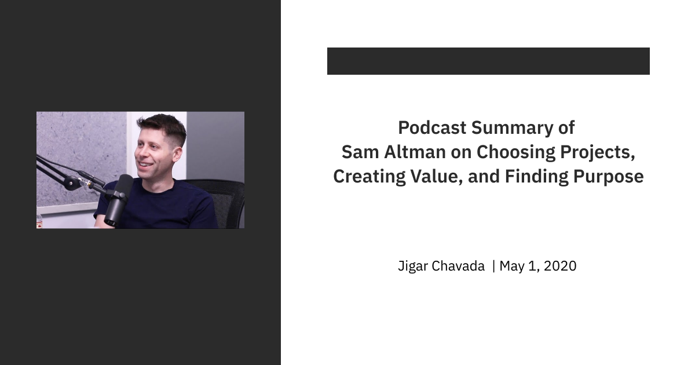

#### **
Link - <ins>https://www.youtube.com/watch?v=uEl2KUZ3JWA</ins>
**
 

- Minimise your cognitive load from distracting things that don't really matter. It's hard to overstate how important this is and how most people are bad at it.

- Take time and explore a lot of things, try to have a beginners mindset about what's working and what isn't but trust your intuitions and pursue a lot of things as cheaply and quickly as possible and then be honest with yourself about what's working and what's not, and the hard part, cut all the stuff that's not working and focus down and down until you are eventually focussed on the one thing that's really working.

- Follow your interests, try to pursue a lot of projects that seem interesting, realise that most of them will fail, but it doesn't matter as long as the ones that work really work.

- Try to always be in explore mode and try a lot of projects and accept that most won't work.

- Q - How to decide on what to commit to and when?  
A - It takes brutal honesty with your self, which projects are actually working and which you are actually convincing yourself are working. It's a very hard thing to train yourself to do. But it is a muscle that is buildable though.

- Learn that you are majorly wrong most of the times, but that's ok as long as the magnitude of the success pays for all the failures.

- Things in life are rarely as risky as they seem. Most people are too risk-averse and so most advice is biased towards conservative paths.

- What risk looks like is, you look back at the end of the career and you are like "oh I have wasted it". But most people don't think about risk that way.

- We are very good at thinking about short term catastrophic risk than thinking about the long term chronic risk. Like we worry about nuclear plant meltdowns but not about inhaling coal smoke. 

- As we get older, getting a shift in perspective gets harder and harder. It's an unbelievably valuable thing to get, and this is why people like to end up, taking lots of psychedelic drugs. It is generally not considered the best approach, but keeping this sort of mental flexibility, to like look at things with a fresh perspective, new angles, this is very important to hold onto.

- Surround yourself with people who will make you more ambitious, make you more inquisitive, shift your perspective. It is really important

- Almost everyone including yourself wants you to be more average as it's a lot more comfortable.

- One thing that helps productivity is accountability. 

- The fear that many people have is like all the cool things are already built. Why do people feel that way?
    1. to seem world-weary (feeling or indicating feelings of weariness, boredom, or cynicism as a result of long experience of life).
    2. people like to complain

- Figuring out the balance between how much random flux you accept in your life for how much waste of time is hard. One thing you can do is take on a lot of random things and waste 90% of your time, be frustrated with yourself for the waste of time but then that one thing makes it worth for all of that. Most of the times it is so painful but sometimes it is so valuable.

- Never believe in the concept of deferred life plan. (I will do this thing but later, or after I do this other thing).
Example: I want to work on rockets, but only after I have the financial security and don't need to worry about money. It more often than not happens that you won't acquire money nor will you work on rockets.

- If you want to do some particular thing, then you only need to work for that particular thing and not some other.

- This deferred life plan empirically doesn't work