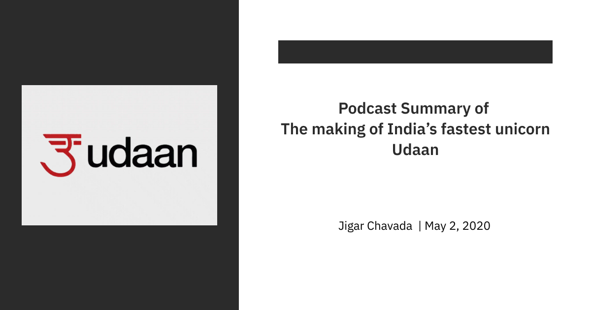

#### **
Link - <ins>https://www.youtube.com/watch?v=3ItkrgAgkF8</ins>
**
 

- The founders of Udaan were critical in scaling the largest Indian commerce company - Flipkart.
   - Amod Malviya - Prev. CTO, Flipkart
   - Sujeet Kumar - Prev. President Of Operations, Flipkart
   - Vaibhav Gupta - Prev. SVP Business, Finance & Analytics, Flpkart

- Udaan is the fastest Unicorn in India.

- For the founders, the decision to work together came first instead of the idea. They started playing around with a number of ideas after coming together.

- They laid out three major criteria for the idea:
    1. Impact a large no of people
    2. Problem where tech can play a disruptive role
    3. Have a uniquely Indian flavour

- B2B commerce hit all three criteria very very strongly.

- They saw at Flipkart that mobile and internet adoption in India at that time was going through the roof and that opens up a way to just change all existing industries

- A major chunk of India was not available online before but now it was.

- India is different from China as well as all the other countries in terms of society & economy. The most important thing compared to China and the US was although digital adoption was going through roof, purchasing power was still very low, for the core Indian. 

- There is a lot of opportunity for building different businesses for core India. India is a small business economy. A domestic trade economy.

- They were trying to build a large scale distribution machinery, at core based on mobile and internet and e-commerce technology.

- The belief was that you build this large scale distribution machinery because the market is so big, you can create an alternate way to reach out to these small businesses.

- In the absence of Udaan, small manufacturers couldn't tap on to the demand. They had to rely on layers and layers of wholesalers.

- Udaan helps to give these small manufacturers a platform to be able to reach out to the large demand which was not possible before.

- Based on the kind of business you are in you see a certain selection of sellers who sell products which you need for your business.

- In many ways, Udaan is similar to Flipkart, but we shouldn't be too prejudiced by B2C concept.

- Structurally there are a lot of elements from a technology perspective that are same. Cataloguing systems, Search and Recommendation systems, Checkout systems and Supply Chain systems.

- But then you quickly realise, while there are similarities there are also things that are uniquely B2B.

- On the supply chain side, you discover that the weight profile of shipment is actually very different for a B2C. So you need to design the supply chain systems and processes to reflect that.

- Credit in the B2C domain ends up being about EMIs for very large ticket purchases. But in B2B, trade credit is a way of life. It is very much ingrained in how people actually purchase. 

- Government is trying to empower MSME, by employment after agriculture this is the sector employing the largest number of people.

- Udaan is trying to give them access of technology, trying to empower them so that they can grow their business so that they can purchase better so that they can manage their working capital better, access of better selection so that they can do business in their local community using their personal relation with customer.

- The whole platform was built thinking about how they can empower them

- Previously, the cumbersome thing was, go to faraway locations to purchase goods, block the trading capital, transport the goods with them, then selling and again wait to build the capital so that they can go again and do the same process on loop.

- Udaan solved the sourcing problem for these retailers, and now these have their own audience either through personal relationships or being part of the community they can sell better products to.

- Also, why restrict them at one category, consumers buy a lot of things from FMCG to fashion to electronics. The guy can do all these if you solve the sourcing problem which Udaan is trying to solve.

- Internet is about creating symmetry of information, but the offline market is so much information asymmetric. There are a set of people who have the knowledge and set of people that don't have and a bunch of people within.

- Udaan is trying to empower them by providing this information and the ability to succeed.

- During their times at Flipkart, the founders learnt all sort of things like how to see infrastructure like a warehouse, how to rent properties, last-mile delivery, hiring, culture. All those benefits from Flipkart are helping them now and they are building on those learnings.

- Cataloguing in B2B is much more difficult than B2C, but the retail buyer is much more smarter than a normal consumer. Like when you list, these goods from Agra are priced at 499, he/she knows the quality of it, if you are getting phone cover from the city-centre, then he/she knows that what quality it will be.

- People have this sense of what the product is, so they are leveraging a lot of buyers intelligence about the products on the platform. 

- Let's say in a tier 3 city, someone wanted to open a retail shop, earlier it was very difficult to source, from where to buy the raw goods. But now using Udaan he/she doesn't have to worry about that.

- Unless you think of e-commerce in tandem with payment, logistics and lending, you can't solve any problem.

- It is very important to focus only on the merit of the discussion and not who is talking about it or what is the title of the person who is talking about it.