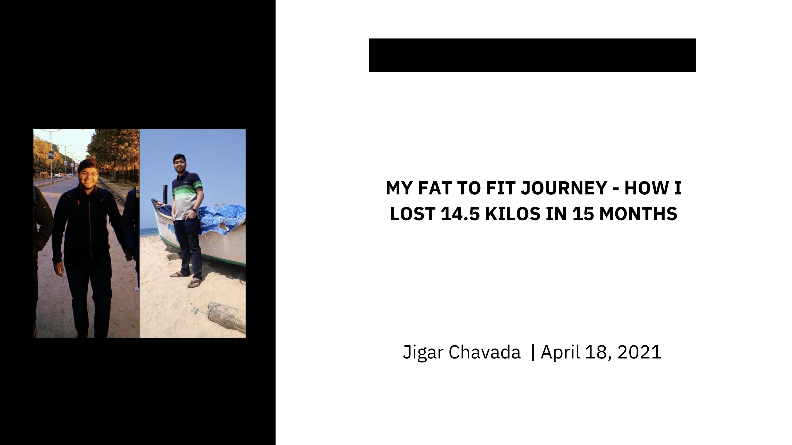
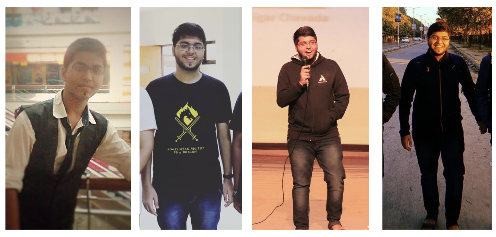
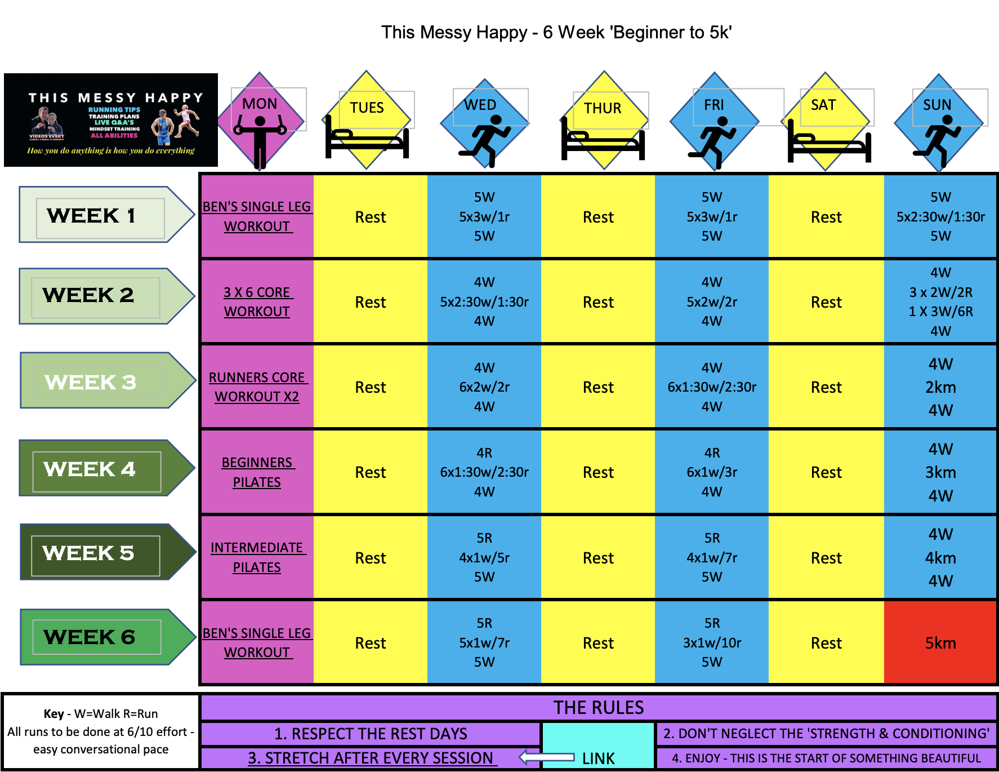
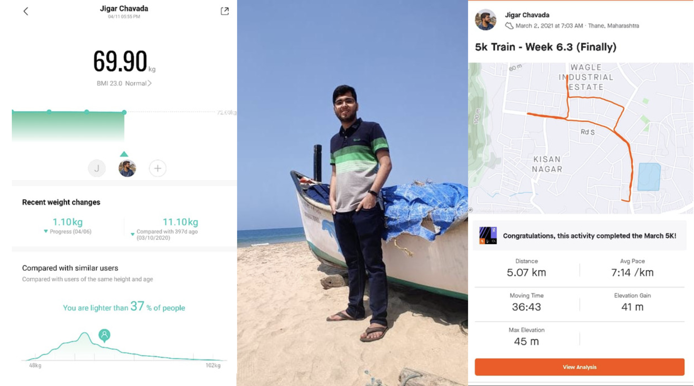

Some backstory to give context: 

I, for most of my childhood days, was a skinny kid. In my family, there wasn't a system of pocket money because of which I never used to eat outside food and consume junk. But all this changed when I started coaching for JEE. It was the first time I had to travel a significant distance away from my house (around 3KM each side) which led to my parents start to give me money for my commute as well as extra safe money, but that extra safe money concept turned into snack money and then lunch money. Slowly and steadily, I started not to take home meals and used to always eat outside. This one habit along with all the stress one needs to go through while cracking such a tough exam as JEE resulted in me putting on weight rapidly. I must have gained more than 20 Kilos during those years to land at a solid 72 KG when I first entered college in July 2017.

Seventy-Two kilograms is not a lot considering my height, I was borderline overweight. If I was smart enough at that time and controlled my bad eating habits I would have been fine, but the freedom along with the money you get from your parents when you live 1400 KMs away from them increase multifold. So here I was with added freedom and more cash than ever to exploit my junk cravings whenever I wanted. I guess this theme is the same across all college students. Nearly 75% of people I know in college were in a situation like mine. So in nearly 2.5 Years (July 2017 to December 2019), I increased my weight even more and landed at my Global Maxima of 84.5 Kilos. I have attached some sample pictures below to let you know how much of my body had changed. It was not just the outward appearance, once you put on weight you can very well feel the same passiveness within you as well. I was very lazy and a typical couch potato, who would sweat at the slightest of instances when asked to do anything physical. This record maximum and the feelings within led me to do something about it, I just couldn't go with the flow now. I had to take things in my control and step the gear away from the autopilot.

This was the tipping point that started my 15 months journey to weight loss. Although the science behind weight loss is very easy, just burn more calories than you consume. It is said that a deficit of 7000 calories is equivalent to losing 1KG of fat from the body. So, let's say your body expends 2000 calories in a day and you intake 1500 calories every day for a week, That means a deficit of 500 * 7 days = 3500 calories, which is approx 0.5 kgs. So if you continue the same for a month, you will lose 2Kgs and that is considered a healthy rate of weight loss.
All of this sounds so simple, but when you start this journey it is not very intuitive and the time taken to break bad habits is much longer than to form good habits IMO. It is more difficult psychologically to make yourself eat less and exercise more when in most part of the last 5 years you have done just the opposite. Will power and motivation comes at play here more than at any other point in the journey. I was always clear of the fact that good things take time and I can't expect to lose a shit ton in the blink of an eye and also I was very much aware that it is going to be hard and there will be moments where I will want to quit and just be like, 'I am OK with the weight and I shouldn't bother to do anything about it' but I was determined.

Now, starts the 5th Semester, it is January 2020. I make a promise to myself that I will do incremental progress and try to achieve small targets weekly. I also made sure to pick up running as a habit and was glad to find people in my batch who also joined me in this quest of forming this habit. So, what I would do is have a couple of my friends (Harsh Aryan and Yash Agarwal) wake me up at 6:30 in the morning and come with me on the ground and run with me. Initially, it was very difficult, the 1st day I ran, I couldn't complete even a single round of the ground which was about 400m without stopping to catch myself a breath and on the other hand I saw my friends running 4-5 rounds with ease. I was feeling so helpless that my body can't even run a 400m round without sweating like a pig. But I remembered that I can't expect this from myself given the lifestyle I choose to live during the last 5 years, I have to suck it up and work hard. I was up for the challenge. I made a streak of going to the ground every single day at 6:30 AM in the cold mornings of Allahabad of about 7-8 degrees. I could see myself progress each day, I was getting better each day, at the end of those 10 days I was able to run 3 rounds without stopping. One fun incident was during one of the hackathons, I was with my team coding up till 4:30 AM and was fearing I couldn't run the next morning if I went to sleep and I was feeling so sleepy that I can't explain it, still I was determined to maintain the streak so even in that sleepy state I picked myself up and went to the ground and ran 2.5 rounds before sleeping. These 10 days were so amazing and seeing the progress was very exciting and I even checked my weight and I had lost a solid 1.5 Kilos in 10 days, I was ecstatic. 
Now, what was about to happen to me I couldn't have imagined, it was the sports fest Asmita in our college and I very childishly played a game of Sumo wrestling with my friend Tanmay and got my ass kicked along with a broken arm (Ligament tear in the Elbow). This was a big set back, as now I couldn't run. It took me around 1 month to just able to heal the arm to a point where I could exert myself on the arm and bear the pain. So once I was able to bear a little pain, I again started running, it was the funniest sight to see a person with plaster in his hand running while both his hands were supported by each other. Nonetheless, I didn't care, running was just so joyous for me I couldn't control myself. This was around early March. I also made good progress on the weight front and measured myself 81 Kgs on March 10th, 2020. As we all know this was the same time around which Covid struck us and in a matter of 15 days I was back in Mumbai at my house with complete lockdown across the nation and this halted my journey.

From the start of April to September, many things happened. I interned at Gojek, got myself placed at Udaan, started another internship with a US-based startup and the whole country kind of went through its first wave of Covid. In October, I thought to continue the journey I started that year. To my surprise, I had lost an additional 4 Kgs during this time, this can be attributed to walking 1 hour daily on my terrace. I was 77Kg and very happy to see that I was still on the right track. The restrictions still were there and running alone was something that I didn't want to do during that time. I decided to continue the daily walks and hoped that I would reduce weight with this strategy only. But I hit a plateau at 76Kg, it was 2 months in and I wasn't getting much thinner. That's when I thought *ki running shuru karni padegi*. I always dreamt of running a 5k (equivalent to 12.5 rounds of the college ground, the max I did was still 3 rounds), I took myself up to that challenge of going 0 to 5k. To achieve this goal I needed a plan and a quick Google search handed me just the plan which I needed. 

I was very disciplined and would religiously follow this plan. I used to get up at 6:30 AM, the same as college times. To get myself to commit I even purchased the best running shoes ever (Adidas Ultraboost 20) and I kid you, not those are more expensive than the phone I use. According to the plan at the end of the 2nd week, I needed to run 2KM straight without stopping, I always dreaded that day and used to think *ki yeh toh nahi hi hoga*, but as I said I was always up for the challenge and was not going to make a no-show. The morning when I finally ran that 2K, I was so amazed by myself that I can do this. After that day there was no seeing back and I was amazed by myself everyday I ran, every day I was doing my Personal Best yet. The day of running 5k finally came, and without much hardships, I was able to complete that at a 7:15 /km pace which is considered to be very good considering my standards. At the end of everything, I lost around 4Kgs more and was at 72. I was 72 last when I joined the college in July 2017. I was the lightest I had been in 3.5 Years. Another 1 month of gymming and walking and running got me under 70 Kgs. On 11th April 2021, I weighed myself at 69.9 Kgs. 

This sense of achievement is so different from anything I have ever done in my life and sharing this in the form of this blog post makes me so much proud that I can achieve things that I didn't think were possible for me. I hope this story of mine helps anybody who is reading to embark on a similar journey and know if you commit yourself to it, everything is possible in life.